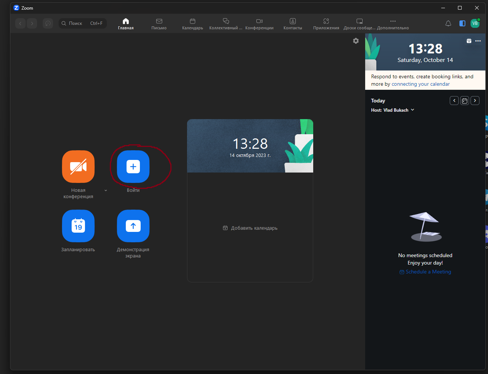
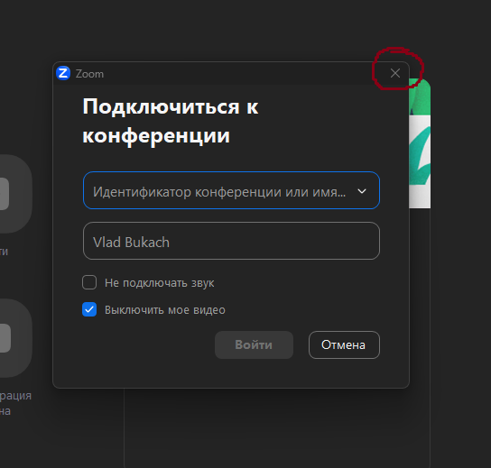
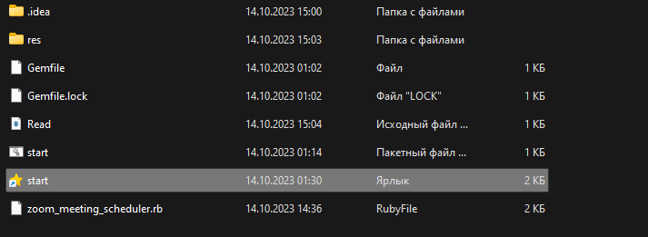

## How to run Script ##

### First step ###

**_Go to file schedule.json and add your timetable for my example_**

    `{
    "schedule": {
    "monday": {
    "8:00": "zoom-link",
    "9:35": "zoom-link"
    }
    }`

### Second step ###

**_Go to file open-zoom.au3 and edit path to zoom.exe file_**

    `Run("C:\path\to\zoom.exe")`

### Third step ###

**_Open zoom before run script and press to button Enter Conf_**

**_And close window with connect_**

### Forth step ###

**_Run start(star icon)_**
