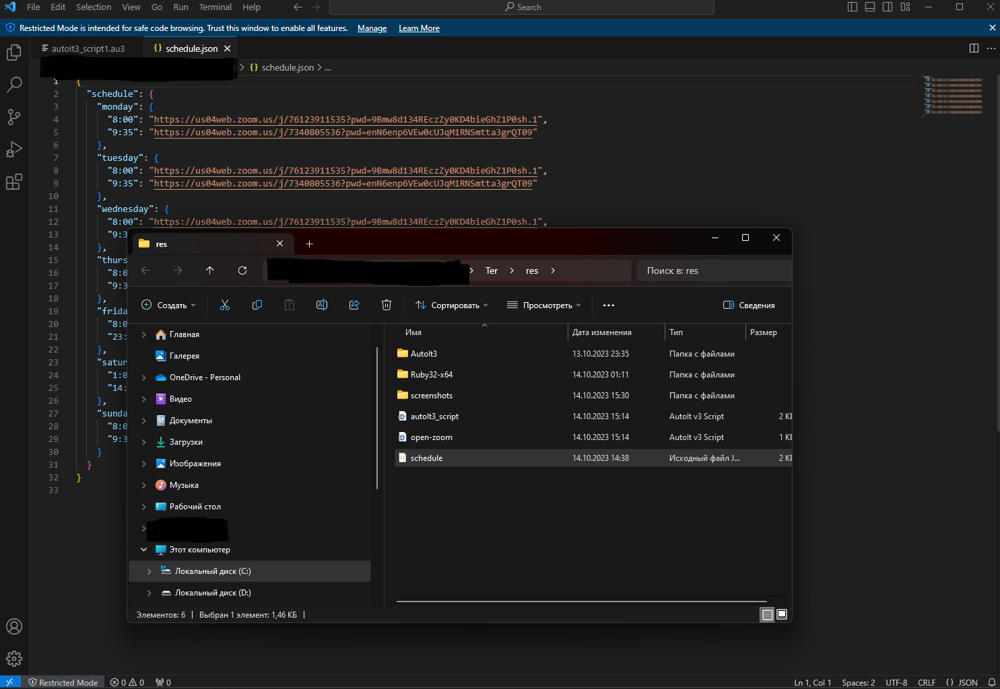
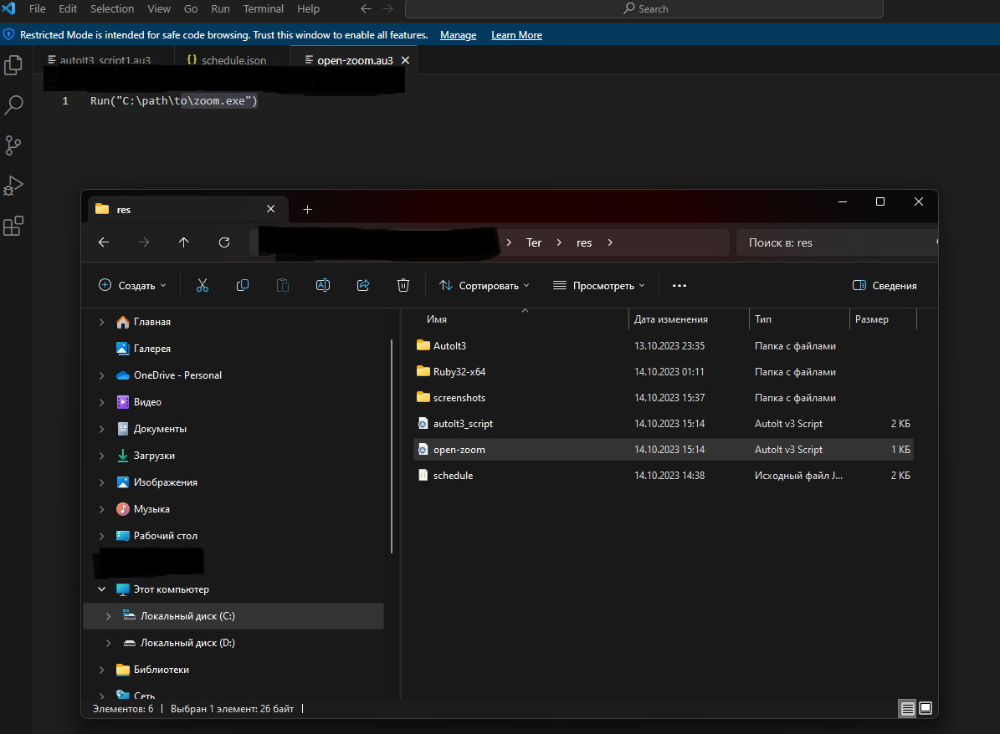
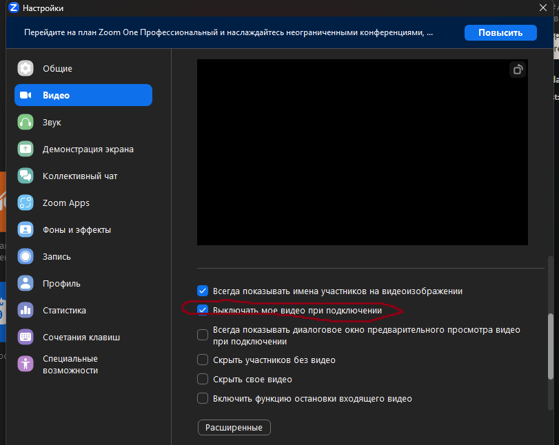
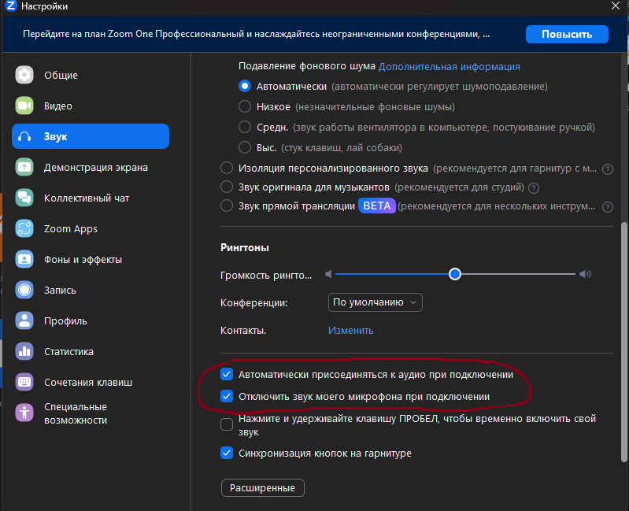

# About Zoom-connect #

Zoom Auto Join is a tool that allows you to automatically join Zoom meetings. The app works with AutoIt and requires you to enter the meeting ID and password (if applicable). The app will automatically open the Zoom window, enter the meeting ID and password, and then click the "Join" button.

Key features:

Automatically joins Zoom meetings
Supports meeting IDs and passwords
Easy to use

The app can be helpful for people who frequently attend Zoom meetings.
The app can be used to automate the process of joining meetings.
The app is free and open source.

## How to run Script ##

### First step ###

**_Go to file schedule.json and add your timetable for my example_**

    `{
    "schedule": {
    "monday": {
    "8:00": "zoom-link",
    "9:35": "zoom-link"
    }
    }`

### Second step ###

**_Go to file open-zoom.au3 and edit path to zoom.exe file_**

    `Run("C:\path\to\zoom.exe")`

### Third step ###

Repeat my zoom settings _**!!!!! Important !!!!!**_

### Fourth step  ###

**_Open zoom before run script and press to button Enter Conf_**

**_And close window with connect_**

### Final step ###

**_Run start(star icon)_**

## Important ##

**_Your computer must work, if you go sleep plz setting your battery setting in computer, computer must work!!!_**